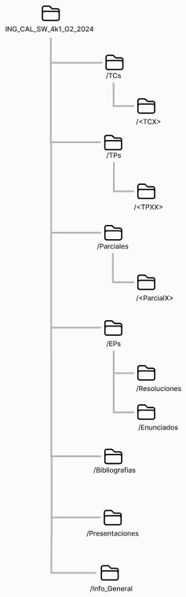

# **Gestión de la Configuración de Software**

Universidad Tecnológica Nacional - Facultad Regional Córdoba

Carrera: Ingeniería en Sistemas de Información

Cátedra: Ingeniería y Calidad de Software

Curso: 4K1

Año: 2024

Grupo número: 2

Fecha de entrega: 29/8/2024

Docentes

- Judith Meles.
- Mickaela Crespo.
- Constanza Garnero.

Integrantes del Grupo

- Bordino Coniglio, Tobías Martín - 93611 - [tobordino@gmail.com](mailto:tobordino@gmail.com)
- Caffaro Santiago - 90364 - [santycaffaro7@gmail.com](mailto:santycaffaro7@gmail.com)
- Ceballos Colombo, Mateo - 90419 - [mceballoscolombo@gmail.com](mailto:mceballoscolombo@gmail.com)
- Cocimano, Federico José - 89555 - [fedecochi@gmail.com](mailto:fedecochi@gmail.com)
- Moreno, Tomás Agustín - 90365 - [tomasmoreno351@gmail.com](mailto:tomasmoreno351@gmail.com)
- Suarez, Emiliano Fabricio - 91134 - [suarezemilianofabricio@gmail.com](mailto:suarezemilianofabricio@gmail.com)

---

## **Estructura completa**

## **Listado de ítems de configuración**

| **Nombre** | **Regla de Nombrado** | **Ubicación** |
| --- | --- | --- |
| Enunciado de Trabajo Práctico | IS_<TPXX>_Enunciado.pdf | <URL_Repo>/TPs/<TPXX> |
| Entregable de Trabajo Práctico | IS_<TPXX>_<Tema_TP>.pdf | <URL_Repo>/TPs/<TPXX> |
| Enunciado de Trabajo Conceptual | IS_<TCX>_Enunciado.pdf | <URL_Repo>/TCs/<TCX> |
| Entregable de Trabajo Conceptual | IS_<TCX>_<Tema_TC>.pdf | <URL_Repo>/TCs/<TCX> |
| Parciales Resueltos | IS_Resolución_<Leg>.pdf | <URL_Repo>/Parciales/<ParcialX> |
| Parciales Templates | IS_Template.docx | <URL_Repo>/Parciales/<ParcialX> |
| Ejercicios Prácticos Resolución | IS_Ejercicio_<NE>_<Leg>.pdf | <URL_Repo>/EPs/Resoluciones |
| Ejercicios Prácticos Enunciados | IS_<Nombre_Guía>.pdf | <URL_Repo>/EPs/Enunciados |
| Bibliografía | IS_<Tema_B>_<Título_B>.pdf | <URL_Repo>/Bibliografías |
| Presentaciones de Clase | IS_<ClaseXX>_<Tema_C>.pdf | <URL_Repo>/Presentaciones |

## **Glosario**

| **Sigla** | **Significado** |
| --- | --- |
| \<URL_Repo> | Dirección web del repositorio: https://github.com/cocimano/ING_CAL_SW_4k1_G2_2024/blob/main |
| \<TPXX> | Número de Trabajo Práctico. Ejemplos: TP01, TP15 |
| \<Tema_TP> | Nombre Tema Correspondiente al TP |
| \<TCX> | Número de Trabajo Conceptual. Ejemplos: TC01, TC15 |
| \<Tema_TC> | Nombre Tema Correspondiente al TC |
| \<NE> | Nombre de Ejercicio |
| \<ParcialX> | Número de Parcial. Ejemplos: Parcial1, Parcial2 |
| \<Leg> | Legajo estudiante que desarrolló el archivo |
| \<Nombre_Guía> | Nombre de la guía de trabajos prácticos. Ejemplo: |
| \<Tema_B> | Nombre del tema correspondiente a la bibliografía |
| \<Título_B> | Nombre de la bibliografía |
| IS | Nombre de la materia, Ingeniería y Calidad de Software |
| \<ClaseXX> | Número de clase. Ejemplos: 01, 02, 10 |
| <Tema_C> | Tema Clase. Ejemplo: SCM |

## **Criterios de línea base**

La línea base se actualizará después de recibir y aplicar las correcciones correspondientes a cada Trabajo Práctico, asegurando que los cambios reflejen las mejoras y ajustes solicitados por las docentes.

## **Link a repositorio:**

[https://github.com/ING_CAL_SW_4k1_G2_2024](https://github.com/cocimano/ING_CAL_SW_4k1_G2_2024)
